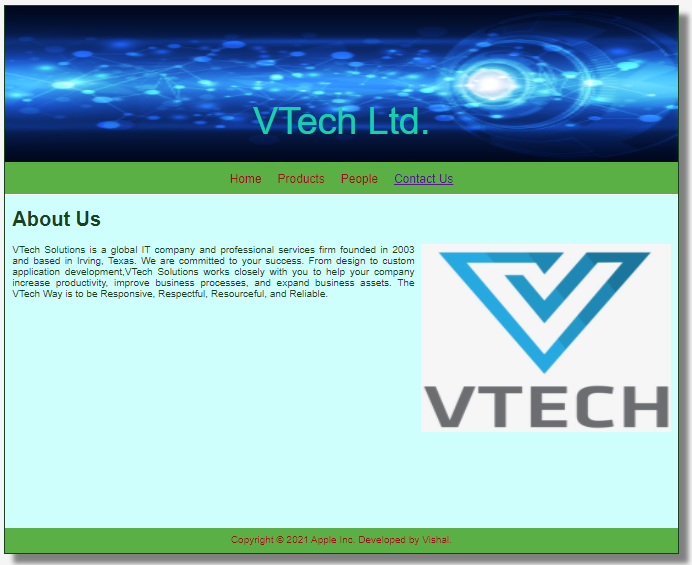
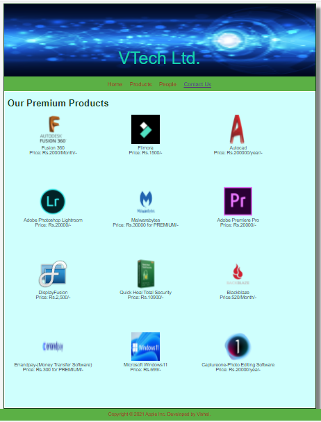
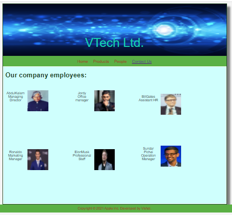
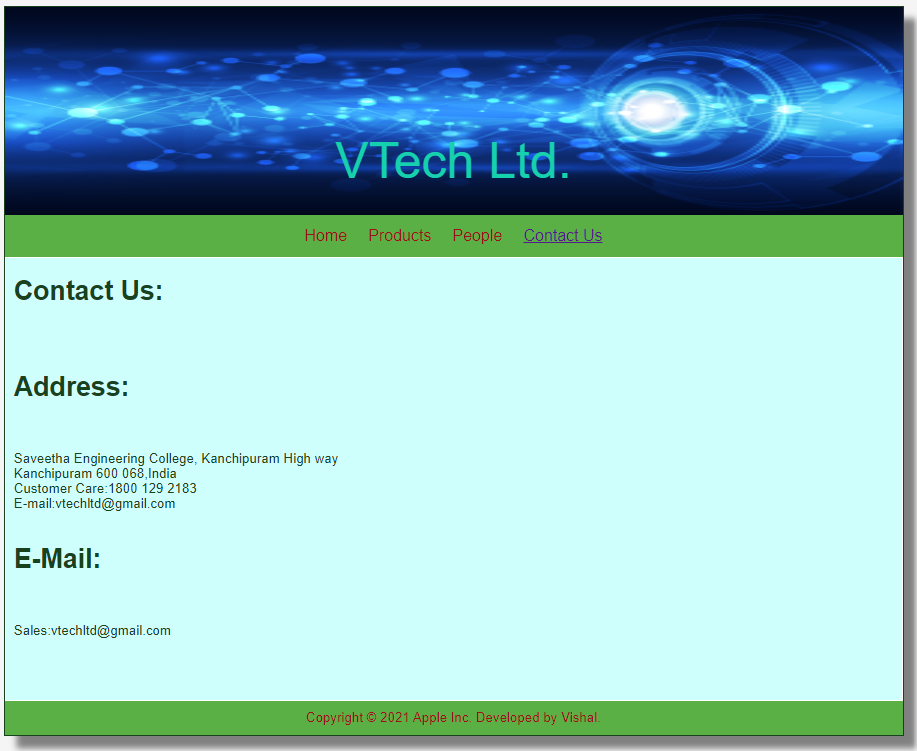

# Web Design for a Software Product Company

## AIM:

To design a static website for a software product company company.

## DESIGN STEPS:

### Step 1:

Requirement collection.

### Step 2:

Creating the layout using HTML and CSS.

### Step 3:

Updating the sample content.

### Step 4:

Choose the appropriate style and color scheme.

### Step 5:

Validate the layout in various browsers.

### Step 6:

Validate the HTML code.

### Step 6:

Publish the website in the given URL.

## PROGRAM :
## Home Page:
```
<!DOCTYPE html>
<html lang="en">
  <head>
    <title>Apple Inc.</title>
    <link rel="stylesheet" href="./css/layout.css" />
    <link rel="icon" href="./img/icon.png" type="image/x-icon" />
  </head>

  <body>
    <div class="container">
      <div class="banner">Santech Ltd.</div>
      <div class="menu">
        <div class="menuitem"><a href="/static/home.html">Home</a></div>
        <div class="menuitem"><a href="/static/products.html">Products</a></div>
        <div class="menuitem"><a href="/static/people.html">People</a></div>
        <div class="menuitemselected"><a href="/static/contactus.html">Contact Us</a></div>
        </div>
      <div class="content">
        <div class="homecontent">
          <h1>About Us</h1>
          
          <div class="contenttext">
            SanTech Solutions is a global IT company and professional services firm founded in 2003 and based in Irving, Texas.

We are committed to your success. From design to custom application development, SanTech Solutions works closely with you to help your company increase productivity, improve business processes, and expand business assets.

The SanTech Way is to be Responsive, Respectful, Resourceful, and Reliable.


          </div>
        </div>
      </div>
      <div class="footer">
        Copyright &#169; 2021 Apple Inc. Developed by Sanjay.
      </div>
    </div>
  </body>
</html>
```
## Product Page:
```
<!DOCTYPE html>
<html lang="en">
  <head>
    <title>Apple Inc.</title>
    <link rel="stylesheet" href="./css/layout.css" />
    <link rel="icon" href="./img/icecream1.png" type="image/x-icon" />
  </head>

  <body>
    <div class="container">
      <div class="banner">Santech Ltd.</div>
      <div class="menu">
        <div class="menuitem"><a href="/static/home.html">Home</a></div>
        <div class="menuitem"><a href="/static/products.html">Products</a></div>
        <div class="menuitem"><a href="/static/people.html">People</a></div>
        <div class="menuitemselected"><a href="/static/contactus.html">Contact Us</a></div>
        </div>
      <div class="content">
        <div class="productcontent">    
          <h1>Our Premium Products</h1>
          <div class="productitems">
              <div class="productitem"> 
                  <div class="itemimage">
                  
                  </div>
                  <div class="itemname">Fusion 360</div>
                  <div class="itemprice">Price: Rs.2000/Month/- </div>
              </div>
              <div class="productitem"> 
                  <div class="itemimage">
                  
                  </div>
                  <div class="itemname">Flimora</div>
                  <div class="itemprice">Price: Rs.1500/- </div>
              </div>
              <div class="productitem"> 
                <div class="itemimage">
                
                </div>
                <div class="itemname">Autocad</div>
                <div class="itemprice">Price: Rs.200000/year/- </div>
              </div>
              <div class="productitem"> 
                <div class="itemimage">
                
                </div>
                <div class="itemname">Adobe Photoshop Lightroom </div>
                <div class="itemprice">Price: Rs.20000/- </div>
            </div>
            <div class="productitem"> 
              <div class="itemimage">
              
              </div>
              <div class="itemname">Malwarebytes</div>
              <div class="itemprice">Price: Rs.30000 for PREMIUM/- </div>
          </div>  <div class="productitem"> 
            <div class="itemimage">
            
            </div>
            <div class="itemname">Adobe Premiere Pro</div>
            <div class="itemprice">Price: Rs.20000/- </div>
          </div>  <div class="productitem"> 
            <div class="itemimage">
            
            </div>
            <div class="itemname">DisplayFusion</div>
            <div class="itemprice">Price: Rs.2,500/- </div>
          </div>  <div class="productitem"> 
            <div class="itemimage">
            
            </div>
            <div class="itemname">Quick Heal Total Security</div>
            <div class="itemprice">Price: Rs.10900/- </div>
          </div>   <div class="productitem"> 
            <div class="itemimage">
            
            </div>
            <div class="itemname">Blackblaze</div>
            <div class="itemprice">Price:520/Month/- </div>
        </div>  <div class="productitem"> 
          <div class="itemimage">
          
          </div>
          <div class="itemname">Errandpay-(Money Transfer Software)</div>
          <div class="itemprice">Price: Rs.300 for PREMIUM/- </div>
      </div>  <div class="productitem"> 
        <div class="itemimage">
        
        </div>
        <div class="itemname">Microsoft Windows11</div>
        <div class="itemprice">Price: Rs.699/- </div>
    </div>  <div class="productitem"> 
      <div class="itemimage">
      
      </div>
      <div class="itemname">Captureone-Photo Editing Software</div>
      <div class="itemprice">Price: Rs.20000/year- </div>
  </div>
      
            </div>
          </div>
          </div>        
      </div>
      <div class="footer">
        Copyright &#169; 2021 Apple Inc. Developed by Sanjay.
      </div>
    </div>
  </body>
</html>
```
## People Page:
```
<!DOCTYPE html>
<html lang="en">
  <head>
    <title>Apple Inc.</title>
    <link rel="stylesheet" href="./css/layout.css" />
    <link rel="icon" href="./img/ail.png" type="image/x-icon" />
    </head>
    <body>
    <div class="container">
      <div class="banner">Santech Ltd.</div>
      <div class="menu">
        <div class="menuitem"><a href="/static/home.html">Home</a></div>
        <div class="menuitem"><a href="/static/products.html">Products</a></div>
        <div class="menuitem"><a href="/static/people.html">People</a></div>
        <div class="menuitemselected"><a href="/static/contactus.html">Contact Us</a></div>
        </div>
      <div class="content">
        <div class="homecontent">
          <h1>Our company employees:</h1><br><br>
          <div class="productitems">
            <div class="productitem"> 
                <div class="itemimage">
                
                </div>
                <div class="itemname">AbdulKalam</div>
                <div class="itemprice">Managing Director</div>
            </div>
            <div class="productitem"> 
                <div class="itemimage">
                
                </div>
                <div class="itemname">Jordy</div>
                <div class="itemprice">Office manager</div>
            </div>
            <div class="productitem"> 
              <div class="itemimage">
              
              </div>
              <div class="itemname">BillGates</div>
              <div class="itemprice">Assistant HR</div>
            </div>
            <div class="productitem"> 
              <div class="itemimage">
              
              </div>
              <div class="itemname">Ronaldo</div>
              <div class="itemprice">Marketing Manager</div>
          </div>
          <div class="productitem"> 
            <div class="itemimage">
            
            </div>
            <div class="itemname">ElonMusk</div>
            <div class="itemprice">Professional Staff</div>
        </div>  <div class="productitem"> 
          <div class="itemimage">
          
          </div>
          <div class="itemname">Sundar Pichai

          </div>
          <div class="itemprice">Operation Manager</div>
      </div>
          </div>
        </div>
        </div>        
    </div>
    <div class="footer">
      Copyright &#169; 2021 Apple Inc. Developed by Sanjay.
    </div>
  </div>
</body>
</html>
```
## ContactUs Page:
```
<!DOCTYPE html>
<html lang="en">
  <head>
    <title>Apple Inc.</title>
    <link rel="stylesheet" href="./css/layout.css" />
    <link rel="icon" href="./img/ail.png" type="image/x-icon" />
  </head>

  <body>
    <div class="container">
      <div class="banner">Santech Ltd.</div>
      <div class="menu">
        <div class="menuitem"><a href="/static/home.html">Home</a></div>
        <div class="menuitem"><a href="/static/products.html">Products</a></div>
        <div class="menuitem"><a href="/static/people.html">People</a></div>
        <div class="menuitemselected"><a href="/static/contactus.html">Contact Us</a></div>
      </div>
      <div class="content">
        <div class="homecontent">
          <h1>Contact Us:</h1><br><br>
          <h1>Address:</h1><br><br>
          <div class="contenttext">
            Saveetha Engineering College,
            Kanchipuram High way<br>
            Kanchipuram 600 068,India<br>
            Customer Care:1800 129 2183<br>
            E-mail:Santechltd@gmail.com
          </div><br>
        
          <h1>E-Mail:</h1><br><br>
          <div class="contenttext">
              Sales:Santechltd@gmail.com
          </div>
        </div>
      </div>
      <div class="footer">
        Copyright &#169; 2021 Apple Inc. Developed by Sanjay.
      </div>
    </div>
  </body>
</html>
```

## OUTPUT:

### Home Page:

### Product Page:

### People Page:

### Contactus Page:


## Result:

Thus a website is designed for the software product company and the HTML,CSS code are validated.
